# Technical Design Document
## AI-Enhanced Product Workflow Demo

**Version:** 1.0
**Date:** December 2025
**Status:** In Development

---

## Table of Contents

1. [System Overview](#system-overview)
2. [Architecture](#architecture)
3. [Components](#components)
4. [AI Agents](#ai-agents)
5. [Communication Flows](#communication-flows)
6. [Data Models](#data-models)
7. [Session Management](#session-management)
8. [Implementation Details](#implementation-details)

---

## System Overview

### Purpose

The AI-Enhanced Product Workflow Demo simulates a realistic product development workflow where AI agents assist three key roles:
- **Customer Success Manager (CSM)** - Captures and structures customer requests
- **Product Manager (PM)** - Analyzes customer insights and prioritizes features
- **Engineering Lead** - Evaluates technical feasibility and creates specifications

### Key Features

- **Parallel Workflow Model**: All three roles can work simultaneously
- **Session-Based State**: User data persists across page refreshes (2-hour TTL)
- **Agent-to-Agent Communication**: PM can automatically trigger Tech Agent for feasibility analysis
- **Real-Time Activity Feed**: Tracks all agent work across the system
- **Structured Data Exchange**: Insights and specifications use well-defined schemas

### Technology Stack

- **Frontend**: React 18 + Vite
- **Backend**: Node.js + Express
- **AI**: Anthropic Claude API (Sonnet 3.5)
- **Session Store**: express-session (in-memory)
- **State Management**: React Hooks (custom useWorkflowState)

---

## Architecture

### High-Level Architecture

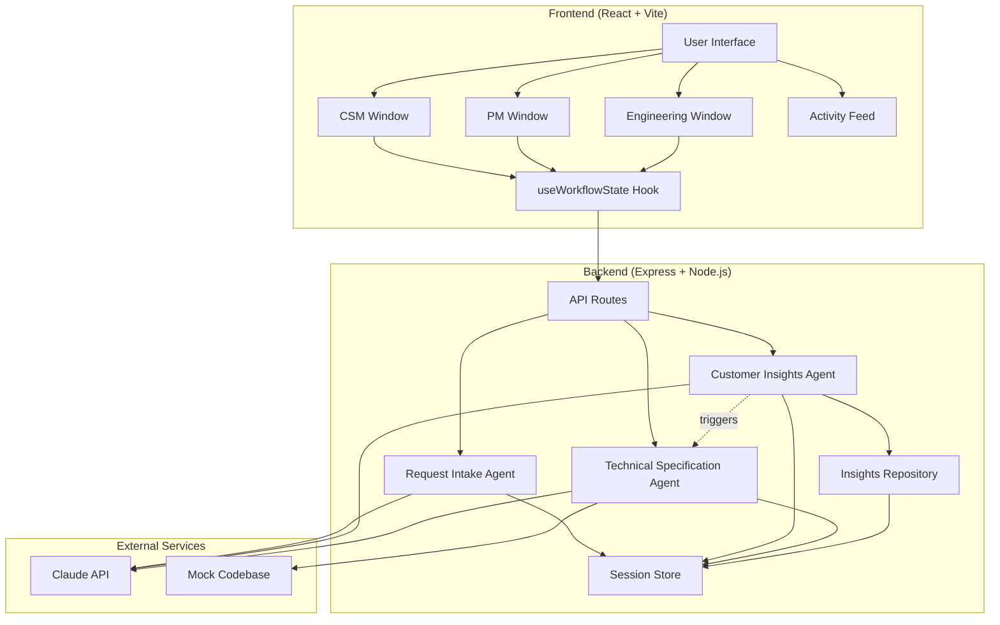

### Component Interaction

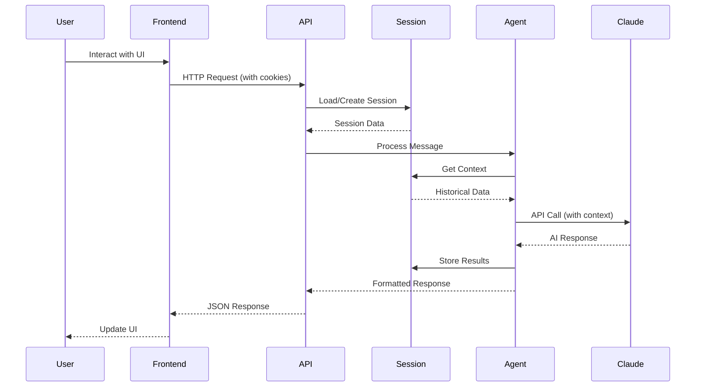

---

## Components

### Frontend Components

#### 1. Layout Component
- **Location**: `src/components/Layout.jsx`
- **Purpose**: Main application container
- **Responsibilities**:
  - Orchestrates all role windows
  - Manages action buttons (Submit Insight, Share with Engineering)
  - Displays activity feed and workflow timeline
  - Handles workflow reset

#### 2. RoleWindow Component
- **Location**: `src/components/RoleWindow.jsx`
- **Purpose**: Reusable chat interface for each role
- **Features**:
  - Message display (user, agent, system messages)
  - Input field with send button
  - Loading indicators
  - Optional action buttons
  - Auto-scroll to latest message

#### 3. useWorkflowState Hook
- **Location**: `src/hooks/useWorkflowState.js`
- **Purpose**: Centralized state management
- **State Managed**:
  - Messages for all three roles
  - Activity feed entries
  - Structured requests and insights
  - Tech spec availability and sharing
  - Loading states

### Backend Components

#### 1. API Routes
- **Location**: `server/routes/agents.js`
- **Endpoints**:
  - `POST /api/agents/intake` - CSM request processing
  - `POST /api/agents/insights` - PM insights analysis
  - `POST /api/agents/techspec` - Engineering technical analysis
  - `POST /api/agents/techspec/autonomous` - Autonomous tech analysis
  - `GET /api/agents/techspec/list` - List tech specs
  - `POST /api/insights/submit` - Submit customer insight

#### 2. Insights Service
- **Location**: `server/services/insightsService.js`
- **Purpose**: Session-based insights repository
- **Features**:
  - Store insights per session
  - Calculate statistics (ARR, urgency, categories)
  - Retrieve insights by session ID
  - Automatic cleanup of expired sessions

#### 3. Claude API Service
- **Location**: `server/services/claudeApi.js`
- **Purpose**: Interface to Anthropic Claude API
- **Functions**:
  - `sendMessage()` - Send messages to Claude
  - `buildMessage()` - Format message objects
  - `extractTextContent()` - Parse Claude responses

---

## AI Agents

### 1. Request Intake Agent (CSM)

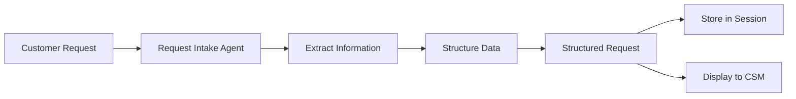

**Role**: Assists Customer Success Managers in capturing customer feature requests

**Input**: Unstructured customer request (text)

**Output**: Structured request object with:
- Customer information (name, tier, ARR, renewal date, health)
- Request details (title, description, category, priority)
- Impact assessment (revenue at risk, competitive threat)
- Business context

**Key Features**:
- Extracts structured data from conversational input
- Searches past requests for similar patterns
- Calculates completeness score
- Provides guidance for missing information

**Implementation**: `server/agents/intakeAgent.js`

### 2. Customer Insights Agent (PM)

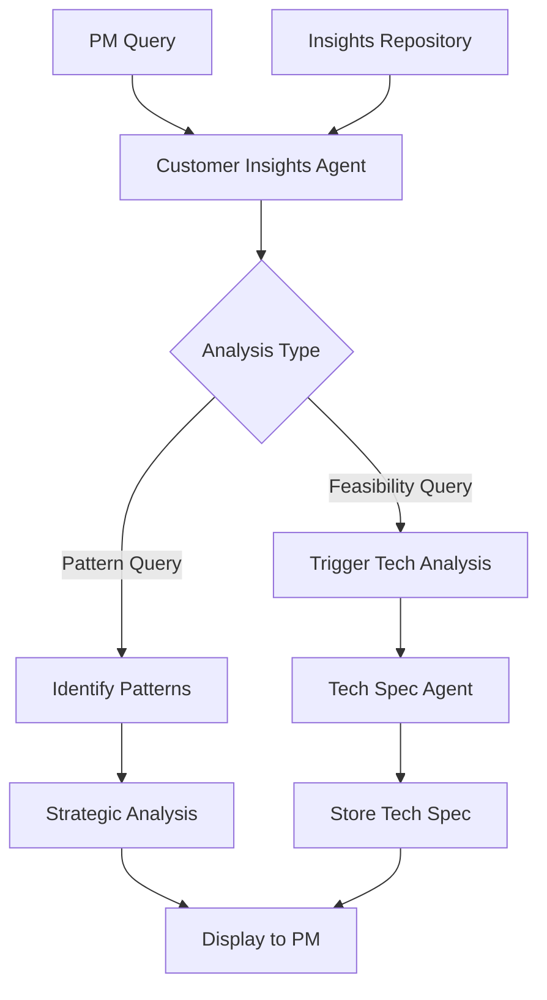

**Role**: Helps Product Managers analyze customer insights and make strategic decisions

**Input**:
- PM's question/query
- Access to insights repository for session

**Output**:
- Pattern analysis and strategic recommendations
- Business impact assessment (ARR, urgency, customer segments)
- Automatic tech analysis trigger when feasibility requested

**Key Features**:
- Synthesizes insights across multiple customers
- Identifies themes and patterns
- Calculates aggregate business metrics
- Automatically coordinates with Engineering when needed
- Uses `[TRIGGER_TECH_ANALYSIS]` marker for agent-to-agent communication

**Implementation**: `server/agents/insightsAgent.js`

### 3. Technical Specification Agent (Engineering)

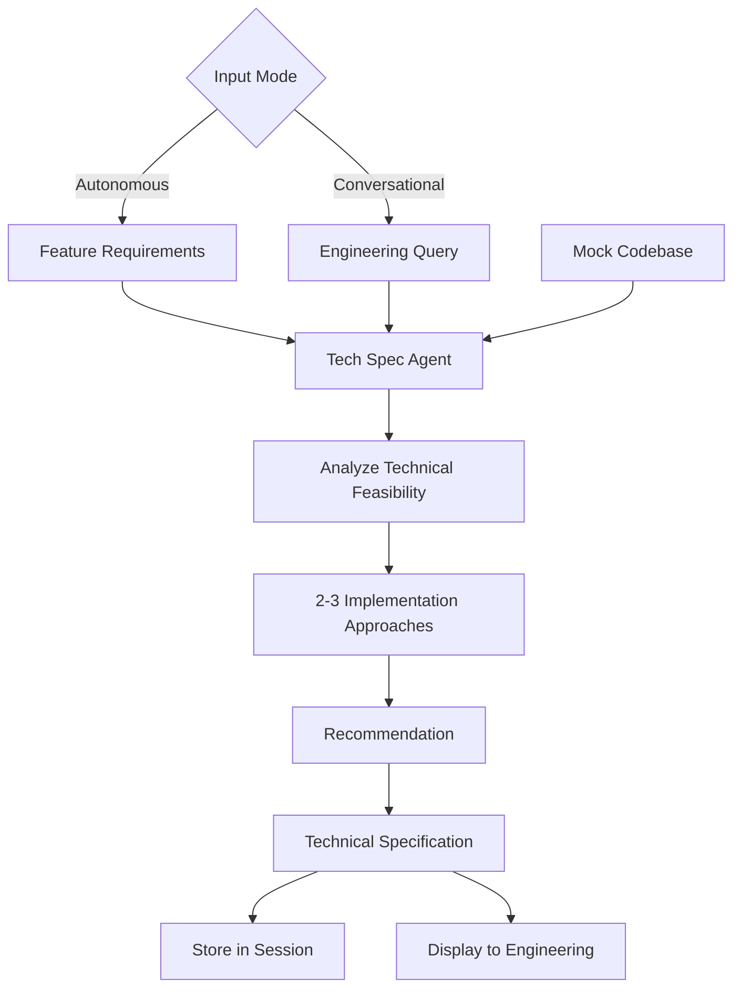

**Role**: Assists Engineering Leads in evaluating technical feasibility and creating specifications

**Modes**:
1. **Autonomous Mode**: Triggered by PM, generates complete specification
2. **Conversational Mode**: Interactive refinement with Engineering Lead

**Input**:
- Feature requirements (from PM or direct input)
- Mock codebase context (components, past implementations)

**Output**: Technical specification including:
- Feature understanding and scope
- Relevant existing components
- 2-3 implementation approaches with pros/cons
- Recommended approach with rationale
- Time estimates and complexity assessment
- Risks and dependencies
- Next steps

**Key Features**:
- References actual codebase components
- Provides specific time estimates
- Compares multiple approaches
- Technical depth appropriate for engineering audience

**Implementation**: `server/agents/techSpecAgent.js`

---

## Communication Flows

### Human-to-Agent Communication

#### Flow 1: CSM Request Processing

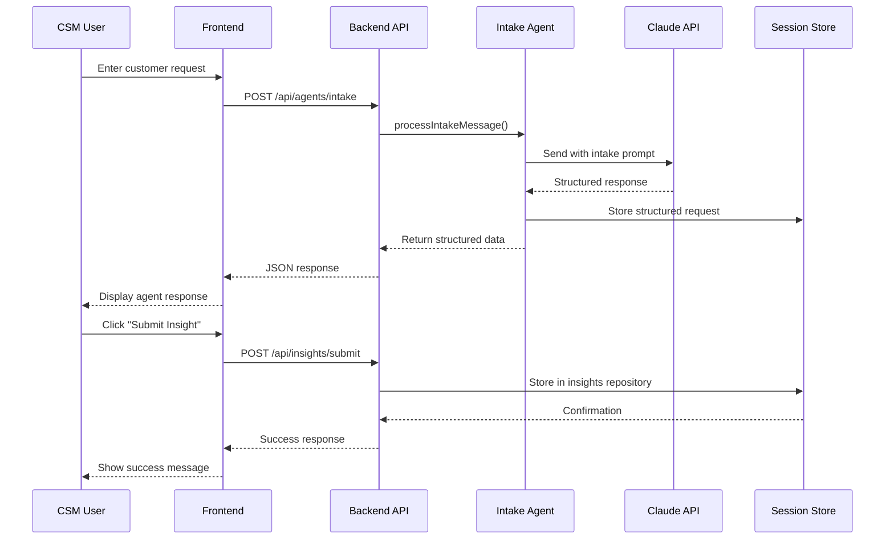

#### Flow 2: PM Insights Analysis (Pattern Query)

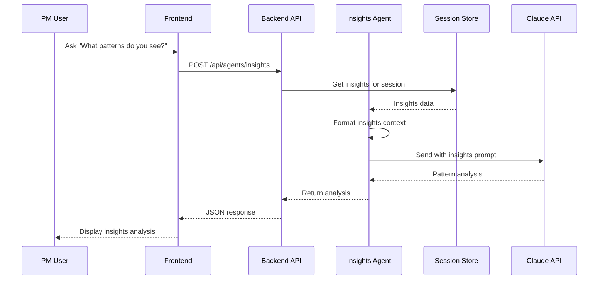

#### Flow 3: Engineering Technical Analysis

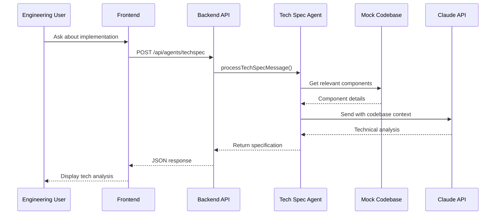

### Agent-to-Agent Communication

#### Flow 4: PM Triggers Tech Analysis (Autonomous)

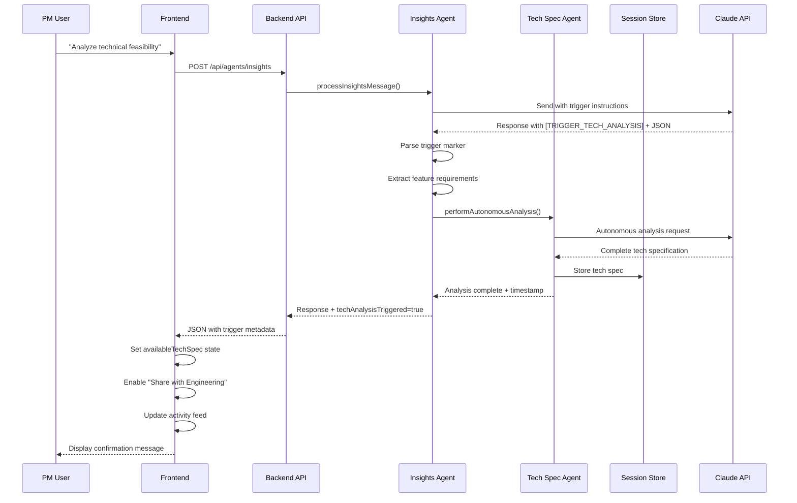

#### Flow 5: PM Shares Spec with Engineering

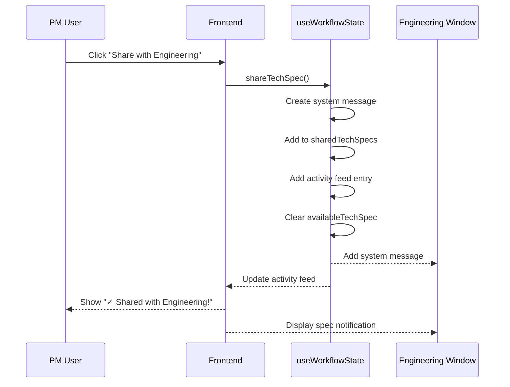

### Complete End-to-End Flow

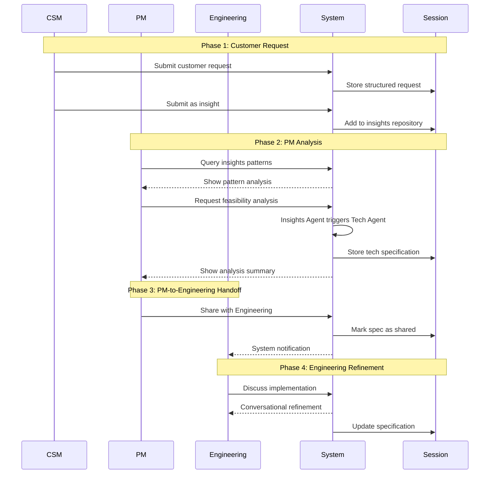

---

## Data Models

### Customer Insight

```javascript
{
  // Metadata
  insightId: "insight-1234567890",
  submittedAt: "2025-12-06T10:30:00Z",
  submittedBy: "CSM",

  // Customer Information
  customer: {
    companyName: "Acme Corp",
    tier: "Enterprise" | "Growth" | "Startup",
    arr: 50000,
    renewalDate: "2025-01-15",
    accountHealth: "Healthy" | "At Risk" | "Champion"
  },

  // Request Details
  request: {
    title: "Bulk CSV Export",
    description: "Need to export 200+ reports simultaneously",
    category: "Data Export" | "Integration" | "Analytics" | etc.,
    priority: "High" | "Medium" | "Low",
    businessProblem: "Manual export taking hours each month"
  },

  // Impact Assessment
  impact: {
    revenueAtRisk: 50000,
    competitiveThreat: "Competitor offers this feature",
    urgency: "High - renewal in 60 days"
  },

  // Metadata
  meta: {
    completeness: 85,
    source: "customer_conversation"
  }
}
```

### Technical Specification

```javascript
{
  // Metadata
  timestamp: "2025-12-06T10:35:00Z",
  mode: "autonomous" | "conversational",

  // Feature Requirements (from PM)
  featureRequirements: {
    title: "Bulk CSV Export for Reports",
    description: "Allow users to export 200+ reports simultaneously...",
    businessContext: "Enterprise customer ($50K ARR, at-risk)...",
    technicalRequirements: "Support 200+ reports, CSV format, async...",
    customerData: {
      count: 1,
      totalARR: 50000,
      urgency: "High - renewal in 60 days"
    }
  },

  // Specification Content
  specification: "## Feature: Bulk CSV Export\n\n...",

  // Codebase Context
  codebaseContext: {
    componentsCount: 8,
    relevantComponents: ["Export API", "Batch Processor"],
    pastImplementations: [...]
  },

  // Usage
  usage: {
    inputTokens: 1200,
    outputTokens: 800
  }
}
```

### Session Data Structure

```javascript
{
  // Session ID (auto-generated)
  id: "sess_abc123...",

  // Session Cookie
  cookie: {
    maxAge: 7200000, // 2 hours
    httpOnly: true,
    secure: false
  },

  // Insights Repository (array of insights)
  insights: [
    { /* Customer Insight object */ },
    { /* Customer Insight object */ }
  ],

  // Technical Specifications (array)
  techSpecs: [
    { /* Tech Spec object */ },
    { /* Tech Spec object */ }
  ]
}
```

---

## Session Management

### Session Lifecycle

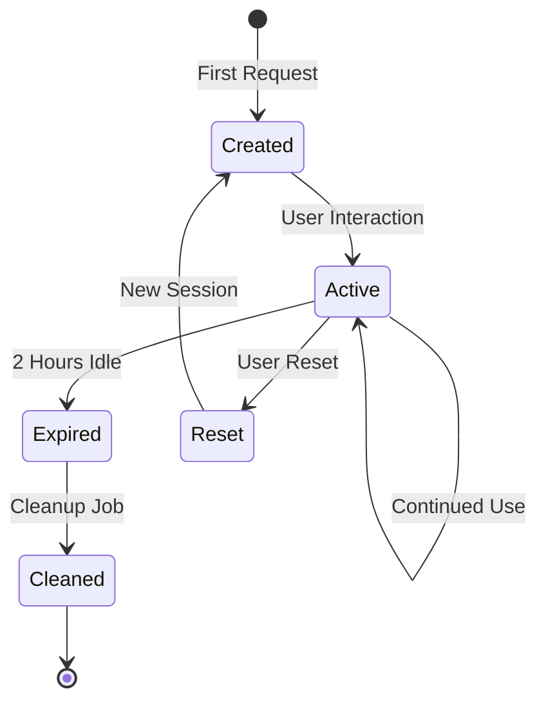

### Session Features

1. **Automatic Creation**
   - Session created on first request
   - Unique session ID generated
   - Cookie sent to browser

2. **Data Persistence**
   - Insights stored per session
   - Tech specs stored per session
   - Survives page refreshes
   - 2-hour Time-To-Live (TTL)

3. **Cleanup**
   - Background job runs every 60 minutes
   - Removes sessions older than 2 hours
   - Frees memory from expired sessions

4. **Session Configuration**

```javascript
app.use(session({
  secret: process.env.SESSION_SECRET,
  resave: false,
  saveUninitialized: true,
  cookie: {
    maxAge: 2 * 60 * 60 * 1000, // 2 hours
    httpOnly: true,
    secure: false // true in production with HTTPS
  }
}));
```

---

## Implementation Details

### Frontend Architecture

#### State Management Pattern

The application uses a custom React hook (`useWorkflowState`) that centralizes all state:

```javascript
const {
  // Messages
  csmMessages, pmMessages, engMessages,

  // Loading states
  csmLoading, pmLoading, engLoading,

  // Data
  structuredRequest, customerInsights,
  availableTechSpec, sharedTechSpecs,

  // Handlers
  handleCsmMessage, handlePmMessage, handleEngMessage,
  submitInsight, shareTechSpec,

  // Actions
  resetWorkflow
} = useWorkflowState();
```

**Benefits**:
- Single source of truth
- Easy to test and debug
- Consistent state updates
- Encapsulated business logic

#### API Communication Pattern

All API calls use the Fetch API with credentials:

```javascript
const response = await fetch('http://localhost:3001/api/agents/insights', {
  method: 'POST',
  headers: { 'Content-Type': 'application/json' },
  credentials: 'include', // Important: sends session cookie
  body: JSON.stringify({ message, conversationHistory })
});
```

### Backend Architecture

#### Agent Processing Pattern

All agents follow a consistent pattern:

```javascript
export async function processAgentMessage(sessionId, message, conversationHistory) {
  // 1. Get context from session
  const context = getContextFromSession(sessionId);

  // 2. Build system prompt with context
  const systemPrompt = buildSystemPrompt(context);

  // 3. Build messages array
  const messages = buildMessagesArray(conversationHistory, message);

  // 4. Call Claude API
  const response = await sendMessage({ messages, system: systemPrompt });

  // 5. Process response
  const agentResponse = extractTextContent(response);

  // 6. Store results in session
  storeResultsInSession(sessionId, results);

  // 7. Return formatted response
  return {
    response: agentResponse,
    usage: response.usage,
    metadata: { /* ... */ }
  };
}
```

#### Agent-to-Agent Trigger Pattern

The Insights Agent uses a special marker to trigger the Tech Agent:

```javascript
// 1. Insights Agent includes trigger in response
const agentResponse = `
Analysis summary here...

[TRIGGER_TECH_ANALYSIS]
{
  "title": "Feature Name",
  "description": "...",
  "businessContext": "...",
  "technicalRequirements": "..."
}
`;

// 2. Backend detects trigger marker
const triggerIndex = agentResponse.indexOf('[TRIGGER_TECH_ANALYSIS]');
if (triggerIndex !== -1) {
  // 3. Extract JSON using brace-matching parser
  const featureRequirements = parseJSON(agentResponse);

  // 4. Trigger autonomous tech analysis
  const techResult = await performAutonomousAnalysis(sessionId, featureRequirements);

  // 5. Store in session
  req.session.techSpecs.push(techResult);

  // 6. Return metadata to frontend
  return {
    techAnalysisTriggered: true,
    techAnalysisResult: { timestamp, featureTitle }
  };
}
```

### Security Considerations

1. **API Key Protection**
   - Claude API key stored in environment variables
   - Never exposed to frontend
   - Validated on server startup

2. **Session Security**
   - HTTP-only cookies (not accessible via JavaScript)
   - Secret key for session signing
   - Should use HTTPS in production

3. **Input Validation**
   - Request validation middleware
   - Message length limits
   - Type checking on all inputs

4. **Rate Limiting**
   - Should implement rate limiting in production
   - Prevent abuse of Claude API
   - Protect against DoS attacks

### Performance Considerations

1. **Session Storage**
   - Currently in-memory (not suitable for production)
   - Should use Redis or similar for production
   - Enables horizontal scaling

2. **API Response Times**
   - Claude API typically responds in 2-5 seconds
   - Frontend shows loading indicators
   - Timeout set to 120 seconds for complex requests

3. **Frontend Optimization**
   - React component memoization where appropriate
   - Minimal re-renders through proper state design
   - Virtual scrolling for long message lists (future enhancement)

---

## Future Enhancements

### Planned Features (from plan.md)

1. **Phase 9: Enhanced Agent-to-Agent Communication**
   - Richer context packages
   - Streaming progress updates
   - Multi-step agent workflows

2. **Phase 10: Visual Enhancements**
   - Animated handoffs between roles
   - Interactive workflow visualization
   - Status badges and indicators

3. **Phase 11: Production Readiness**
   - Persistent storage (database)
   - Authentication and authorization
   - Rate limiting and quotas
   - Monitoring and logging
   - Error tracking

### Technical Debt

1. **Testing**
   - Add comprehensive unit tests
   - Integration tests for API endpoints
   - E2E tests for critical user flows

2. **Error Handling**
   - More granular error messages
   - Retry logic for transient failures
   - Graceful degradation

3. **Documentation**
   - API documentation (OpenAPI/Swagger)
   - Component documentation (Storybook)
   - Deployment guide

---

## Appendix

### File Structure

```
agent-simulator/
├── doc/
│   ├── plan.md                          # Development plan
│   ├── project-spec.md                  # Project specification
│   ├── development-workflow.md          # Development workflow
│   └── technical-design.md              # This document
├── server/
│   ├── server.js                        # Express server
│   ├── routes/
│   │   ├── agents.js                    # Agent API routes
│   │   └── insights.js                  # Insights API routes
│   ├── agents/
│   │   ├── intakeAgent.js               # Request Intake Agent
│   │   ├── insightsAgent.js             # Customer Insights Agent
│   │   └── techSpecAgent.js             # Technical Spec Agent
│   ├── services/
│   │   ├── claudeApi.js                 # Claude API wrapper
│   │   └── insightsService.js           # Insights repository
│   └── data/
│       └── mockCodebase.js              # Mock codebase data
├── src/
│   ├── components/
│   │   ├── Layout.jsx                   # Main layout
│   │   ├── RoleWindow.jsx               # Chat window component
│   │   ├── AgentActivityFeed.jsx        # Activity feed
│   │   └── WorkflowTimeline.jsx         # Timeline component
│   ├── hooks/
│   │   └── useWorkflowState.js          # State management hook
│   └── App.jsx                          # Root component
└── package.json                         # Dependencies
```

### Environment Variables

```bash
# Required
CLAUDE_API_KEY=sk-ant-...              # Anthropic API key
SESSION_SECRET=your-secret-key         # Session signing secret

# Optional
NODE_ENV=development                   # Environment
PORT=3001                              # Backend port
VITE_PORT=5173                        # Frontend port
```

### Dependencies

**Frontend:**
- react: ^18.2.0
- react-dom: ^18.2.0
- vite: ^5.0.0

**Backend:**
- express: ^4.18.2
- express-session: ^1.17.3
- @anthropic-ai/sdk: ^0.27.0
- cors: ^2.8.5
- dotenv: ^16.3.1

### API Response Formats

**Successful Response:**
```javascript
{
  success: true,
  response: "Agent response text",
  usage: {
    inputTokens: 1200,
    outputTokens: 800
  },
  // Additional metadata based on endpoint
  metadata: { /* ... */ }
}
```

**Error Response:**
```javascript
{
  error: "Error Type",
  message: "Descriptive error message"
}
```

---

**Document Version History:**

- v1.0 (2025-12-06): Initial technical design document
